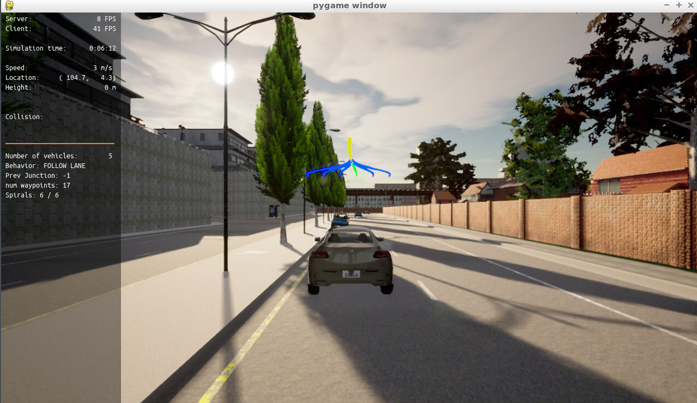

# Udacity Motion Planning and Decision Making for Autonomous Vehicles Project

Within this project, I was tasked with filling in TODO action items to drive CARLA, the simulated autonomous vehicle, around static objects, handle intersections, and track the centerline on the travelling lane. To do so, I had to implement various pieces of behavioral planning logic using Finite State Machines (FSM), static object collision checking, path and trajectory generation using cubic spirals, and calculating the best trajectory selection through a cost function evaluation. Once I finished implementing a section, I removed the TODOs and fixmes (which can be seen through the commit history). All of the files I worked in are in project/starter_files.

## Building and running the project

Within this project, I fully used Udacity's workspace. The instructions provided to build and run was:

In one terminal,

```bash
1. su - student  # <--- This will give a permission denied (which can be ignored)
2. cd /opt/carla-simulator/
3. SDL_VIDEODRIVER=offscreen ./CarlaUE4.sh -opengl
```

In another terminal,

```bash
# 4. If the project hasn't already been installed in the workspace (which is how it was when I first launched the workspace), clone the starter project
5. cd nd013-c5-planning-starter/project
6. ./install-ubuntu.sh
7. cd starter_files/
9. cmake .
10. make
11. cd ../  # Go back a directory to nd013-c5-planning-starter/project
12. ./run_main.sh  # This will silently fail
13. ctrl + C to stop
14. ./run_main.sh  # Second time, it won't fail
15. Go to desktop mode to see CARLA
```

## Summary

After replacing the TODO pieces with actual implementation (and with a few trial and error fixes), I was able to get CARLA to drive pass the static objects, without hitting them, and correctly stop at an intersection.

